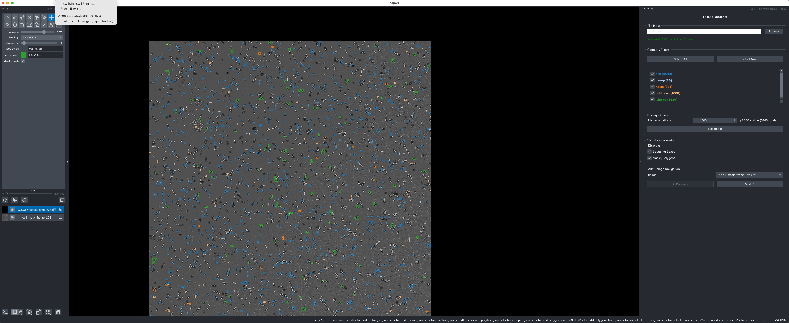

# napari-cocoutils

A napari plugin for visualizing COCO annotation datasets with interactive controls and advanced filtering capabilities. With this plugin you can:

**Interactive COCO Visualization**: Load and visualize COCO JSON annotation files directly in napari  
**Advanced Filtering**: Filter annotations by category with real-time updates  
**Multi-Image Support**: Navigate between images in datasets with multiple images  

Below is an example usage screenshot of how the app looks:



## Installation

### Requirements

- Python 3.10+
- napari 0.6.4+
- [cocoutils](https://github.com/phisanti/cocoutils) - Core COCO manipulation library

### Install from Source

```bash
# Clone the repository
git clone https://github.com/phisanti/napari-cocoutils.git
cd napari-cocoutils

# Create conda environment (recommended)
conda create -n cocoutils python=3.10
conda activate cocoutils

# Install dependencies
conda install -c conda-forge napari pyqt

# Install cocoutils dependency
git clone https://github.com/phisanti/cocoutils.git
pip install -e ./cocoutils

# Install the plugin in development mode
pip install -e .

# Optional: Install development dependencies
pip install -e ".[dev]"
```

### Quick Test Installation

```bash
# Activate the cocoutils environment
conda activate cocoutils

# Test the plugin installation
python -c "import napari_cocoutils; print('Installation successful')"
```

## Usage

1. Launch napari with the plugin:
   ```bash
   napari --plugin napari-cocoutils
   ```

2. Open the COCO Controls widget:
   - Go to `Plugins > napari-cocoutils: COCO Controls`
   - Use the interactive control panel on the right

3. Load and explore your data:
   - Click **Browse** to select a COCO JSON file
   - Use **category checkboxes** to filter annotations
   - Adjust **N-filter** for performance with large datasets
   - Navigate between **multiple images** if available

## Contributing

We welcome contributions! Please see our [Contributing Guide](CONTRIBUTING.md) for details.

## License

This project is licensed under the GNU GENERAL PUBLIC LICENSE version 3 – see the [LICENSE](LICENSE) file for details.

## Citation

If you use napari-cocoutils in your research, please cite:

```bibtex
@software{napari_cocoutils,
  title={napari-cocoutils: Interactive COCO Annotation Visualization},
  url={https://github.com/phisanti/napari-cocoutils},
  year={2025}
}
```

## Acknowledgments

- Built on the powerful [napari](https://napari.org) visualization framework
- Inspired by the [COCO dataset](https://cocodataset.org) format
